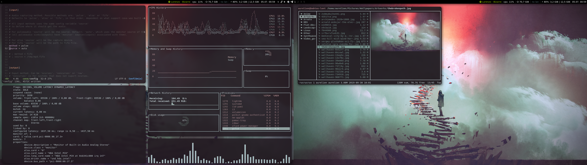
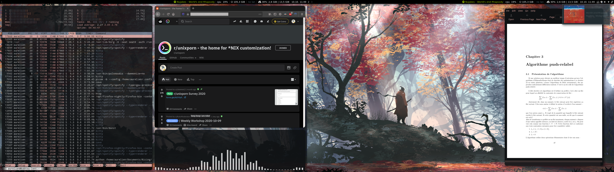

# dots

## About

Personal dotfiles repository.

## dotfiles

Includes dotfiles for :

- [i3-gaps-rounded](https://github.com/resloved/i3)
- [compton / picom](https://github.com/yshui/picom)
- [kitty](https://github.com/kovidgoyal/kitty)
- [neofetch](https://github.com/dylanaraps/neofetch)
- [nitrogen](https://wiki.archlinux.org/index.php/Nitrogen)
- [rofi](https://github.com/davatorium/rofi)

[i3spotifystatus](https://github.com/rpieja/i3spotifystatus) is required in `.i3/config`

Useful links for Spotify ricing :

- [spicetify](https://github.com/khanhas/Spicetify)
- [spicetify-themes](https://github.com/morpheusthewhite/spicetify-themes) (I use the Onepunch theme)

## scripts

Place the content of `scripts` somewhere in your path.
The `ricer` script sets your wallpaper/lockscreen, then generates and apply a
corresponding [pywal](https://github.com/dylanaraps/pywal) theme.
It requires :
- [betterlockscreen](https://github.com/pavanjadhaw/betterlockscreen)
- [pywal](https://github.com/dylanaraps/pywal)
- [oomox](https://github.com/themix-project/oomox)

## Screenshots

Example setup 1 :

Example setup 2 :

(you can find more examples in the `screenshots` folder)
