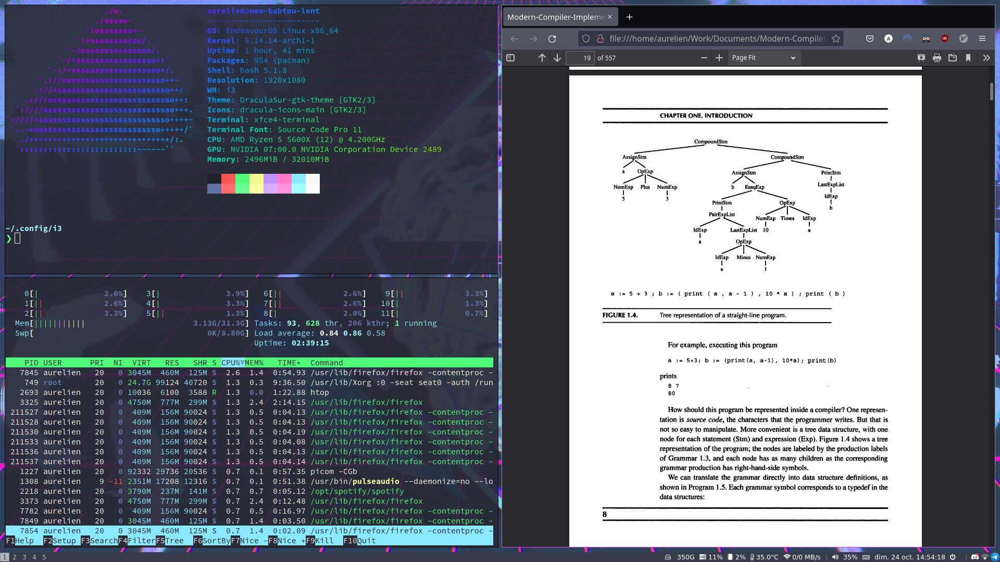

# dots


**[WIP]** This repository contains custom dotfiles based on the
[Endeavour OS i3](https://github.com/endeavouros-team/endeavouros-i3wm-setup)
setup, and is meant to be used ontop of it.

## Scripts

To copy the dotfiles of this repository to the system :

```
bash export.sh
```

To copy the dotfiles of the system to this repository :

```
bash import.sh
```

## Requirements (incomplete)

The dotfiles need the following dependencies for every functionality / shortcut
to work (only those not coming by default with Endeavour OS are listed) :

- [Starship prompt](https://starship.rs/)
- [Spacevim](https://spacevim.org/)
- [Doom Emacs](https://github.com/hlissner/doom-emacs)
- [lolcat](https://archlinux.org/packages/community/any/lolcat/)
- [cava](https://github.com/karlstav/cava)

## Screenshots


